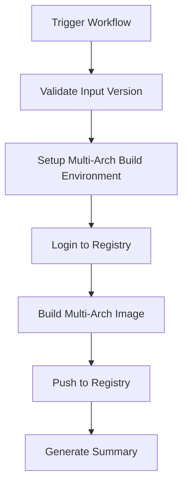

# OpenTelemetry Collector Releaser

This repository provides a GitHub Actions workflow to build multi-architecture Docker images of the OpenTelemetry Collector OSS with Nirmata-specific tagging and customizations.

## 🚀 What This Does

The workflow takes an OpenTelemetry Collector OSS version as input and creates a multi-architecture Docker image tagged with the `nirmata-<OSS-version>` convention.

### Key Features

- **Multi-Architecture Support**: Builds for both `linux/amd64` and `linux/arm64`
- **Version Management**: Accepts any OpenTelemetry Collector OSS version
- **Custom Tagging**: Creates images tagged as `nirmata-<version>`
- **Security Focused**: Uses distroless base images and non-root user
- **Registry Flexibility**: Configurable container registry (defaults to GHCR)

## 📋 Prerequisites

- GitHub repository with Actions enabled
- Container registry access (GitHub Container Registry by default)
- Appropriate permissions to push to the registry

## 🛠️ Usage

### Manual Trigger (Workflow Dispatch)

1. Go to the **Actions** tab in your GitHub repository
2. Select the **"Build OTel Collector Multi-Arch Image"** workflow
3. Click **"Run workflow"**
4. Fill in the required parameters:
   - **OpenTelemetry Collector OSS version**: e.g., `0.115.0`
   - **Container registry**: e.g., `ghcr.io/nirmata` (optional)
   - **Push image to registry**: `true` or `false` (optional)

### Example Usage

```bash
# The workflow will create an image like:
ghcr.io/nirmata/otel-collector:nirmata-0.115.0

# You can then pull and use it:
docker pull ghcr.io/nirmata/otel-collector:nirmata-0.115.0
```

## 🏗️ Architecture

### Workflow Structure



### Docker Build Process

1. **Base Stage**: Uses official `otel/opentelemetry-collector:<version>` as source
2. **Final Stage**: Creates minimal distroless image with the collector binary
3. **Multi-Arch**: Supports both AMD64 and ARM64 architectures
4. **Security**: Runs as non-root user (65532:65532)

## 📁 Repository Structure

```
otel-collector-releaser/
├── .github/
│   └── workflows/
│       └── build-otel-collector.yml    # Main workflow
├── Dockerfile                          # Multi-arch Dockerfile
└── README.md                           # This file
```

## 🔧 Configuration

### Workflow Inputs

| Parameter | Description | Required | Default |
|-----------|-------------|----------|---------|
| `otel_version` | OpenTelemetry Collector OSS version | Yes | - |
| `registry` | Container registry to push to | No | `ghcr.io/nirmata` |
| `push` | Whether to push the image | No | `true` |

### Environment Variables

The workflow automatically sets:
- `OTEL_VERSION`: The input version
- `NIRMATA_TAG`: Formatted as `nirmata-<version>`
- `REGISTRY`: Target container registry

## 🐳 Generated Image Details

### Image Specifications

- **Base Image**: `gcr.io/distroless/static-debian12:nonroot`
- **Binary Source**: Official OpenTelemetry Collector OSS
- **User**: Non-root (65532:65532)
- **Exposed Ports**: 4317 (gRPC), 4318 (HTTP)
- **Architectures**: linux/amd64, linux/arm64

### Image Labels

- `org.opencontainers.image.title`: Nirmata OpenTelemetry Collector
- `org.opencontainers.image.vendor`: Nirmata
- `org.opencontainers.image.version`: nirmata-<version>
- `nirmata.version`: <original-otel-version>

## 🔐 Security Considerations

- Uses distroless base image for minimal attack surface
- Runs as non-root user
- Only copies the necessary collector binary
- No shell or package managers in final image

## 📊 Version Management

### Supported Versions

The workflow supports any valid OpenTelemetry Collector OSS version that follows semantic versioning (X.Y.Z format).

### Tagging Strategy

- **Primary Tag**: `nirmata-<otel-version>` (e.g., `nirmata-0.115.0`)
- **Latest Tag**: `latest` (points to the most recently built image)

## 🚨 Troubleshooting

### Common Issues

1. **Version Format Error**
   ```
   Error: Version must be in format X.Y.Z (e.g., 0.115.0)
   ```
   **Solution**: Ensure the version follows semantic versioning format.

2. **Registry Permission Error**
   ```
   Error: registry authentication failed
   ```
   **Solution**: Verify GITHUB_TOKEN has packages:write permission.

3. **Multi-Arch Build Failure**
   ```
   Error: platform not supported
   ```
   **Solution**: Check if the base OpenTelemetry Collector image supports the target architecture.

### Debug Mode

To enable verbose logging, add this to the workflow:

```yaml
- name: Enable debug
  run: echo "BUILDKIT_DEBUG=1" >> $GITHUB_ENV
```

## 🤝 Contributing

1. Fork the repository
2. Create a feature branch
3. Make your changes
4. Test the workflow
5. Submit a pull request

## 📄 License

This project is licensed under the Apache License 2.0 - see the [LICENSE](LICENSE) file for details.

## 🔗 Related Links

- [OpenTelemetry Collector Documentation](https://opentelemetry.io/docs/collector/)
- [Docker Multi-Platform Builds](https://docs.docker.com/build/building/multi-platform/)
- [GitHub Actions Documentation](https://docs.github.com/en/actions)
- [Nirmata](https://nirmata.com/)

---

**Built with ❤️ for the OpenTelemetry and Nirmata communities** 